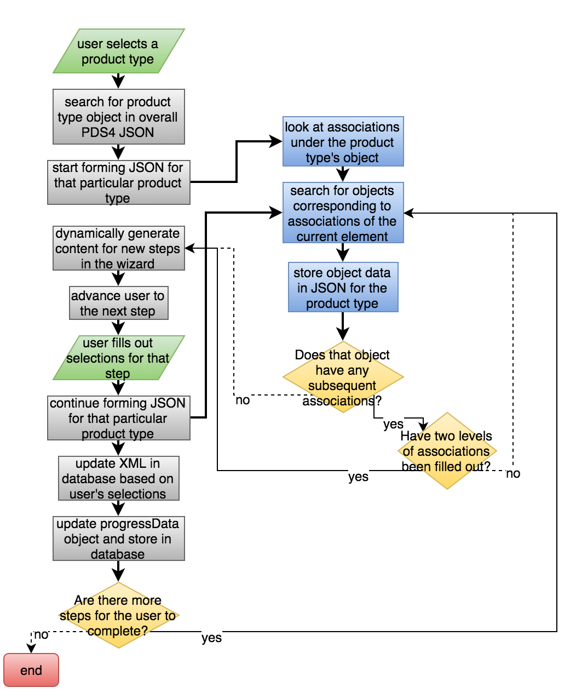
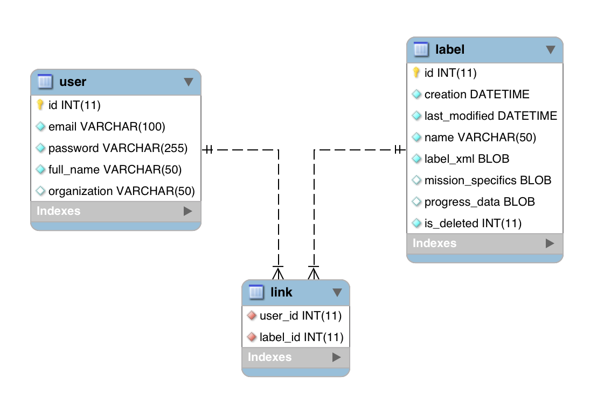

# APPS PDS Label Assistant for Interactive Design (PLAID)

----

Description:
------------
The APPS PLAID is a web GUI to help create PDS4 compliant labels. The core of PLAID is a wizard that walks the user through a sequential process of creating a label. Behind the scenes, PLAID interacts with a MySQL database for storing the user's information and progress through the wizard as well as the actual XML of the label.

Deployment:
-----------
#### Setup an Apache server with PHP

Add the following to your httpd.conf:
```
LoadModule php5_module libexec/apache2/libphp5.so
```

#### Copy the project files from this repo.

Per your DocumentRoot in httpd.conf, you can either copy all of the files there, or create a symbolic link.

####  Setup a MySql database using the attached database dump files (```resources/plaid_dump.sql```).

```
$ mysql -u <user> -p<password> -e 'create database plaid'
$ mysql -u <user> -p<password> < plaid_dump.sql
```

4. Configure the connection instructions in interact_db.php with your database settings.

How PLAID constructs PDS4 labels:
-----------------------------------

####Preparation

Inside of PLAID is the overall PDS4 JSON. This JSON is generated from the schema, which defines the structure and necessary content of a label. After the user selects the product type for their label, PLAID starts creating a new JSON that is a subset of the overall PDS4 JSON. In this new JSON, objects are stored in a hierarchy relating to the structure of the label's XML.PLAID uses the data stored in this new JSON to dynamically create the wizard's content and guide the user through the entire process of creating a PDS4-compliant label.

####Wizard

After the initial set of steps has been dynamically created from the JSON for the selected product type, PLAID handles a variety of tasks behind the scenes as the user progresses through the wizard. 

First, it generates any subsequent steps according to the user's decisions. This is again accomplished by referencing the JSON formed after the user selects the product type. For example, if the user chooses to include an element that has sub-elements, a new step must be created to allow the user to choose which of the sub-elements to include in the label.

Second, it updates the XML based on the user's decisions and stores that XML in the database. In order to accurately place the new XML in the label, the path for the PDS4-attribute is stored in the ID of the HTML element. The path was stored in the ID when the step's content was dynamically created from the JSON data. This path is passed to the backend and used to locate where to place the new element in the XML. Prior to running the XPath query on the backend, the path is parsed so that it maps to the XML structure.

- HTML ID: ```id="0/Identification_Area/1/logical_identifier"```
- Corresponding XML path: ```Identification_Area/logical_identifier```

Third, it captures the user's progress in the wizard and saves it to the database for future loading. This information is stored in a JSON that sits in a column of the label’s table. Upon reloading the wizard, this JSON is used to restore the user’s progress for the selected label.

####Completion

Once the user has completed the process of constructing the label, PLAID presents a preview and the option to export. The preview and file export are both accomplished by getting the XML from the database and either displaying it in the webpage or sending it as a downloadable file.

PLAID Flow Diagram:
-----------------



MySql Database Diagram:
-----------------------


